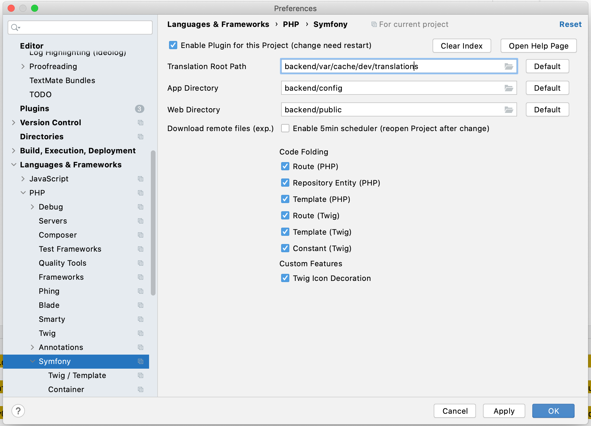
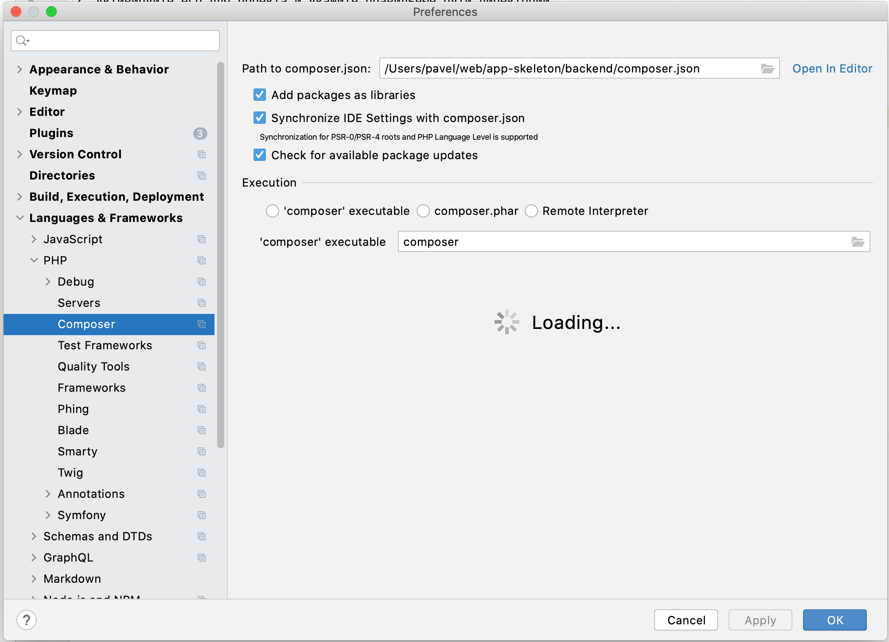

# PhpStorm (backend)

### Symfony
1. Установите плагин [Symfony](https://plugins.jetbrains.com/plugin/7219-symfony-support)
2. Активируйте его для проекта и укажите правильные пути директорий

---

### Composer
Укажите путь до файла **backend/composer.json**

