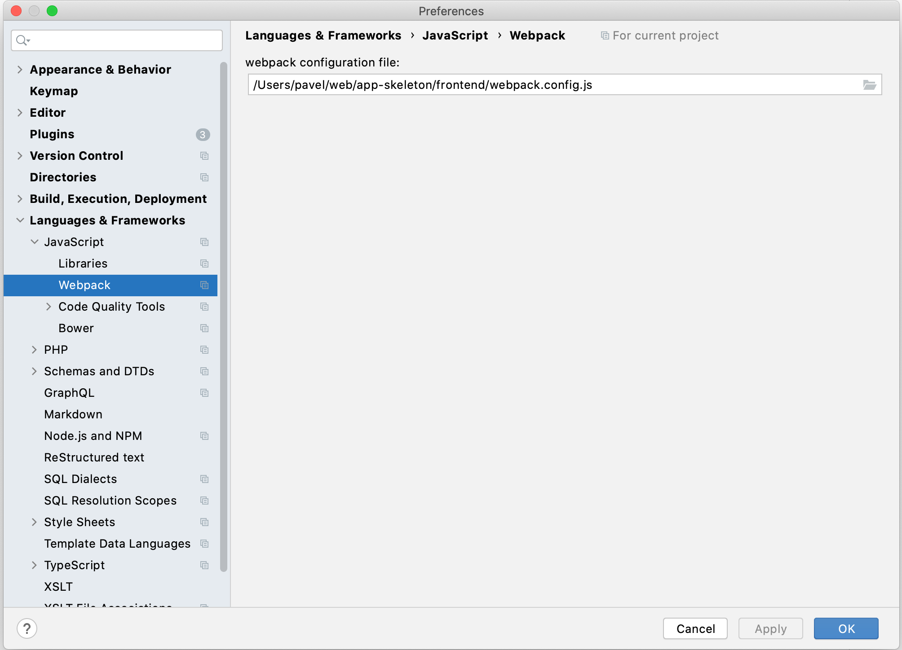
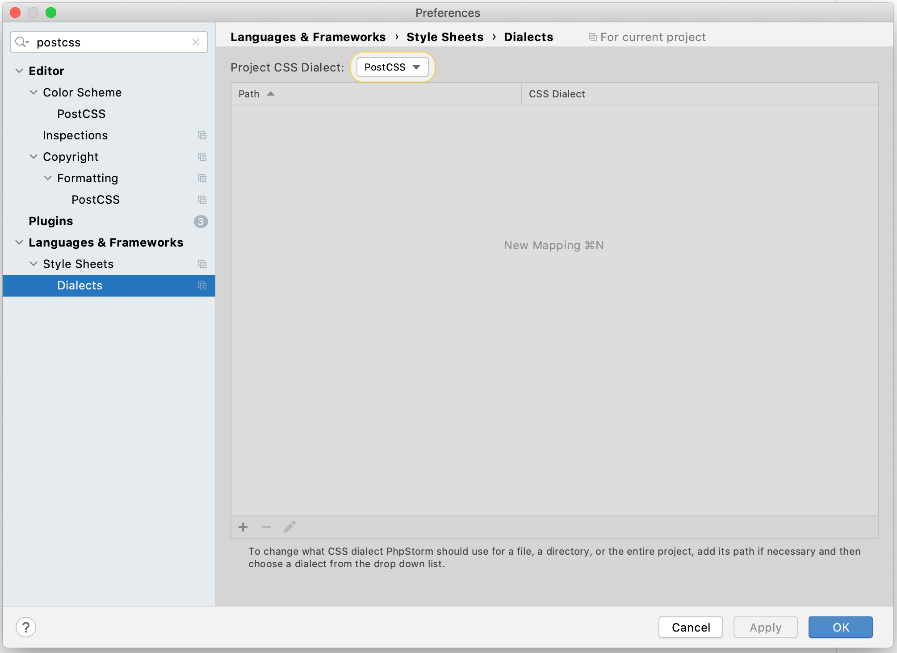

# PhpStorm (frontend)

### Webpack
Укажите путь до файла **frontend/webpack.config.js**

---

### PostCSS
1. Установите плагин [PostCSS](https://plugins.jetbrains.com/plugin/8578-postcss)
2. Измените CSS-диалект на **PostCSS**

